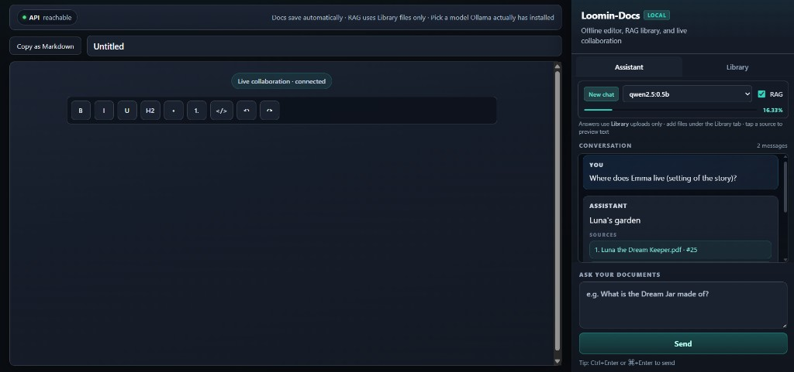
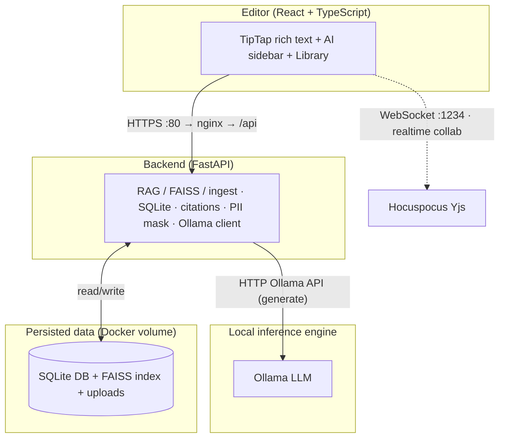
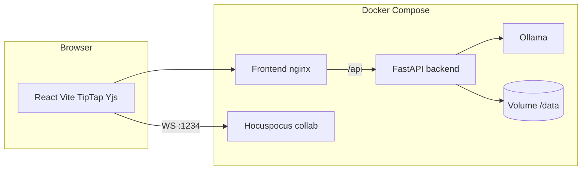

# Loomin-Docs

Production-oriented, **fully offline** document editor with local RAG (FAISS + sentence-transformers) and **Ollama** for LLM inference. Designed for a clean **RHEL 9** air-gapped host using pre-built container images and a local Ollama model bundle.



*The web UI at **http://localhost/** or **http://127.0.0.1/**: document editor with **Live collaboration · connected**, API status strip, and **Assistant** tab showing **New chat**, model (**qwen2.5:0.5b** here), **RAG**, context-use bar, conversation with **Sources**, and **Ask your documents** + **Send**.*

---

## How to run (Docker)

You need **Docker** + **Compose V2**, this repo, a **`.env`**, and **Ollama** reachable the way `.env` describes (on the **host** or in the **`bundle`** container).

### 1. Clone and environment

```bash
git clone <repository-url> loomin-docs
cd loomin-docs
cp env.example .env
```

Edit **`.env`** for your Ollama layout:

| Layout | `OLLAMA_BASE_URL` | `COMPOSE_PROFILES` in `.env` |
|--------|-------------------|------------------------------|
| **Ollama on the host** (Docker Desktop for Windows/Mac; recommended to skip the large Ollama image pull) | `http://host.docker.internal:11434` | Leave **`COMPOSE_PROFILES` unset** (commented out) |
| **Ollama in Docker** (full stack in Compose; air-gap style) | `http://ollama:11434` | Set **`COMPOSE_PROFILES=bundle`** and seed **`deploy/ollama/`** |

Set **`DEFAULT_OLLAMA_MODEL`** to a tag that exists (`ollama list` on the host, or manifests inside **`deploy/ollama/`**). Example: `qwen2.5:0.5b`.

### 2. Build and start containers

Build **backend**, **frontend**, and **collab** (and use **`bundle`** when using container Ollama).

**WSL — repo on a Windows drive** (`/mnt/e/...`, `/mnt/c/...`): use **`bash scripts/compose-wsl.sh`** so Hub pulls avoid broken credential helpers and Buildx state lives under **`~/.docker-loomin-wsl`** (not on drvfs). Do **not** rely on `chmod +x` on `/mnt/e`.

```bash
cd /mnt/e/loomin-docs
bash scripts/compose-wsl.sh build backend frontend collab
bash scripts/compose-wsl.sh up -d
```

**Windows PowerShell** (repo on `E:\`, etc.):

```powershell
cd E:\loomin-docs
.\scripts\compose-wsl.ps1 build backend frontend collab
.\scripts\compose-wsl.ps1 up -d
```

If **`docker compose build`** already works on Windows without the helper:

```powershell
$env:DOCKER_BUILDKIT = "1"
docker compose build --parallel backend frontend collab
docker compose up -d
```

**Linux / macOS** (no WSL):

```bash
export DOCKER_BUILDKIT=1
docker compose build --parallel backend frontend collab
docker compose up -d
```

If you use **`COMPOSE_PROFILES=bundle`**, ensure Compose starts the **`ollama`** profile (the helper scripts pass through to `docker compose`; your `.env` should set **`COMPOSE_PROFILES=bundle`** as in `env.example`).

### 3. Health check

```bash
curl -s http://127.0.0.1:8000/health && echo
```

Expect **`{"status":"ok"}`**. If **`curl -s`** looks empty, the JSON often has **no trailing newline** — append **`&& echo`** or use **`curl -v`**.

### 4. Use the UI

1. Open **http://localhost/** or **http://127.0.0.1/**.
2. **Library** → upload `.pdf` / `.md` / `.txt` → wait until status is **ready**.
3. **Assistant** → leave **RAG** on for grounded answers → ask a question → use **Sources** to open snippet previews.
4. If the sidebar misbehaves after a DB reset, click **New chat**.

### 5. After pulling code or changing UI/API

Images are **baked** into containers — rebuild affected services, then **`up -d`**:

```bash
# WSL + Windows drive:
bash scripts/compose-wsl.sh build backend frontend
bash scripts/compose-wsl.sh up -d
```

WSL credential / Buildx issues are covered in **[WSL: “error getting credentials”](#wsl-error-getting-credentials-when-pulling-images)** below.

---

## For interviewers & evaluators

This repo matches **`project-assesment.md`**: a **real-time collaborative editor** (React) with an **AI sidebar**—RAG over uploaded files, chat, Summarize/Improve on selection, **Ollama** for local inference, SQLite persistence, PII masking hooks, and latency metadata. The **air-gap story** is implemented as **scripts + Compose + manifest**; heavy binaries (Docker RPMs, `docker save` tarballs) are **assembled offline** per **`deploy/bootstrap/PACKAGE_MANIFEST.md`** and are usually **not** stored in Git.

### Pick a path (read this first)

| Your environment | Use | What you need |
|------------------|-----|----------------|
| **Networked** Mac / Windows / Linux / WSL with Docker | **Option A** | Fastest smoke test (~10 min); Ollama on the **host**. |
| **Networked**; all services in Docker | **Option B** | Pull **`ollama/ollama`**; seed **`deploy/ollama/`** if you want inference **without** model downloads at runtime. |
| **No internet** (e.g. clean **RHEL 9** eval VM) | **Option C** + [Offline / air-gapped deployment](#offline--air-gapped-deployment-rhel-9) | **Docker RPMs** on disk, **`deploy/images/*.tar`** (from submitter or build per **`scripts/export_airgap_images.sh`**), full **`deploy/ollama/`** for your model tag, then **`./setup.sh`**. |

**If you only `git clone`:** use **Option A** or **B** on a machine that can **`docker compose build`** and **`ollama pull`**. A **complete submission archive** may add pre-exported images and RPMs; without those, **Option C** on a blank offline host will not work until someone runs the **builder** steps in the offline section.

### Safety & network behavior

- **Inference / RAG at runtime:** With **pre-built images** and a **pre-seeded `deploy/ollama/`**, the running stack does **not** require internet for chat, ingest, or retrieval.
- **Build / first-time setup:** `docker compose build`, `docker pull`, and `ollama pull` use the network unless every image layer and model blob is already local.
- **Data:** Treat this as a **technical demo**. **PII masking** is **regex-only**—not a compliance guarantee; extend **`backend/utils/pii_mask.py`** if needed.
- **Ports to expect:** **80** (UI via nginx), **8000** (API), **1234** (Hocuspocus / Yjs), **11434** (Ollama when the **`bundle`** profile is enabled). Allow these for localhost testing; tighten firewall rules on shared servers.

### Prerequisites

| Requirement | Notes |
|-------------|--------|
| **Git** | Clone this repository (or unpack the submitter’s archive). |
| **Docker** | 24+ recommended; **Docker Compose V2** (`docker compose version`). Legacy `docker-compose` also works if configured. |
| **CPU / RAM** | Backend image includes PyTorch (CPU) + sentence-transformers; **8 GB+** RAM is comfortable. |
| **Browser** | Current Chrome, Edge, or Firefox. |
| **Ollama** | Either on the **host** (Option A) or the **bundled container** (Option B / C with bundle). The model tag must exist in that Ollama (see **`.env`** / **`DEFAULT_OLLAMA_MODEL`**). |

### Option A — Windows / Mac (Docker Desktop): Ollama on the host (recommended for reviewers)

Avoids pulling the multi‑GB `ollama/ollama` image; backend talks to Ollama on your machine.

1. Install **[Ollama](https://ollama.com)** on the host and start it (`ollama serve` if not a service).
2. Pull at least one model, e.g. `ollama pull qwen2.5:0.5b` (must match **`DEFAULT_OLLAMA_MODEL`** in `.env`).
3. **`cp env.example .env`** — keep **`OLLAMA_BASE_URL=http://host.docker.internal:11434`** and **do not** set **`COMPOSE_PROFILES`** (the Compose **`ollama`** service stays off).
4. Build and start using **[How to run (Docker)](#how-to-run-docker)** (plain **`docker compose`** on Windows PowerShell or Mac/Linux; **`bash scripts/compose-wsl.sh`** when using **WSL** with the repo on **`/mnt/e/...`**).
5. Confirm: **`docker compose config >/dev/null && echo compose OK`** and **`curl -s http://127.0.0.1:8000/health && echo`** → **`{"status":"ok"}`**.

Ensure Docker Desktop **WSL integration** is enabled if you use WSL.

### Option B — Bundled Ollama container

Use when you want everything in Docker or are closer to the **air-gap** layout.

1. Prefer a pre-seeded **`deploy/ollama/`** (full `~/.ollama` from a builder). Without it, the container may need network to pull models (not true offline).
2. `.env`:
   ```bash
   OLLAMA_BASE_URL=http://ollama:11434
   DEFAULT_OLLAMA_MODEL=qwen2.5:0.5b
   COMPOSE_PROFILES=bundle
   ```
3. `export DOCKER_BUILDKIT=1 && docker compose build --parallel && docker compose up -d`

First-time pull of **`ollama/ollama:latest`** is large.

### Option C — Air-gapped RHEL 9 (or any machine with no registry access)

Use this when the host **cannot** pull from Docker Hub or download models.

**Checklist before `./setup.sh`:**

1. **Docker installed offline** — RPMs under **`deploy/rpms/`** (placeholders are documented in **`deploy/rpms/README.md`**; filenames depend on your RHEL minor release). Install with **`deploy/bootstrap/install-docker-rhel9-offline.sh`** or `dnf install …/*.rpm --disablerepo='*'`.
2. **Images loaded** — every **`deploy/images/*.tar`** produced on a **builder** with **`./scripts/export_airgap_images.sh`** (see **`deploy/images/README.md`**). `setup.sh` runs **`docker load -i`** on each `*.tar`. If this folder is empty and images are not already on the daemon, **`docker compose up` will fail**.
3. **Models on disk** — **`deploy/ollama/`** must be a full Ollama data directory whose **manifests match `DEFAULT_OLLAMA_MODEL`** in **`.env`**. Copy from a networked machine: `rsync -a ~/.ollama/ ./deploy/ollama/` after `ollama pull <tag>`.
4. **Environment** — `cp env.example .env`. For the bundled Ollama container use **`OLLAMA_BASE_URL=http://ollama:11434`** and a model tag that exists inside **`deploy/ollama/`**.

Then from the repo root:

```bash
chmod +x setup.sh deploy/bootstrap/install-docker-rhel9-offline.sh
./setup.sh
```

`setup.sh` sets **`COMPOSE_PROFILES=bundle`** by default (starts the **Ollama** container). To use **host** Ollama on that machine instead: **`USE_HOST_OLLAMA=1 ./setup.sh`** (install and run Ollama on the host yourself).

Full step-by-step and evaluator notes: **[Offline / air-gapped deployment (RHEL 9)](#offline--air-gapped-deployment-rhel-9)**.

### URLs and ports

| What | Where |
|------|--------|
| **Web UI** | http://localhost/ |
| **API** | http://localhost:8000/ |
| **Health** | http://127.0.0.1:8000/health |
| **Yjs / Hocuspocus** | `ws://localhost:1234` |
| **Ollama** (only if `COMPOSE_PROFILES=bundle`) | http://localhost:11434/ |

### What to try in the browser

1. **Library** — Upload `.pdf` / `.md` / `.txt`; wait until ingest status is **ready**.
2. **Assistant** — Enable RAG, ask something grounded in the upload; check **citations** (clickable).
3. **Editor** — Select text → **Summarize** or **Improve** in the bubble menu.
4. **Model dropdown** — Must list Ollama models from `/api/models`; pick one that exists (`ollama list` on host or in bundle).

### Automated checks (optional, for graders)

With containers up and **Python 3** available on the host (or WSL):

```bash
python3 scripts/multi_query_rag_test.py
python3 scripts/targeted_rag_checks.py
python3 scripts/complex_rag_tests.py
docker compose run --rm --no-deps -v "$(pwd)":/repo:ro -w /repo \
  -e DATA_DIR=/tmp/rag_verify -e SKIP_OLLAMA=1 backend python test_rag.py
```

Full pipeline + log file: `./scripts/run_assessment_verification.sh` → **`assessment-run.log`**.

- **`SUBMISSION-VERIFICATION.md`** — assignment crosswalk, **recorded RAG query results** (tables), and reproduce commands.
- **`project-assesment.md`** — original company requirements (filename as received).
- **`deploy/bootstrap/PACKAGE_MANIFEST.md`** — what belongs in a **single offline bootstrap archive** (RPMs + image tars + `deploy/ollama/`).

### Evaluator checklist (run completely & safely)

1. Follow **[How to run (Docker)](#how-to-run-docker)** — **`cp env.example .env`**, align **`OLLAMA_BASE_URL`** / **`DEFAULT_OLLAMA_MODEL`** / **`COMPOSE_PROFILES`** with **Option A**, **B**, or **C**.
2. Start the stack (WSL on a Windows drive: **`bash scripts/compose-wsl.sh …`**).
3. **`curl -s http://127.0.0.1:8000/health && echo`** → **`{"status":"ok"}`**.
4. Browser: **http://localhost/** or **http://127.0.0.1/** — **Library** (upload → **ready**), **Assistant** (RAG, **Sources**), editor **Summarize** / **Improve** (expected layout is shown in the **screenshot at the top** of this README).
5. Optional: **`SUBMISSION-VERIFICATION.md`**; **`./scripts/run_assessment_verification.sh`** → **`assessment-run.log`**.

### Troubleshooting (interview machines)

| Problem | What to do |
|---------|------------|
| `depends on undefined service "ollama"` | Ensure you have the latest `docker-compose.yml`: **backend** does not `depends_on` **ollama** when `ollama` uses **`profiles: [bundle]`**. Use **Option A** without `COMPOSE_PROFILES`, or **Option B** with `COMPOSE_PROFILES=bundle`. |
| Chat **502** / Ollama errors | Host Ollama: run `ollama serve`, then `ollama list` — include the tag in **`DEFAULT_OLLAMA_MODEL`**. |
| Linux + `host.docker.internal` | Compose sets `extra_hosts: host.docker.internal:host-gateway` on **backend**. If it still fails, set `OLLAMA_BASE_URL` to the host’s IP (e.g. `http://172.17.0.1:11434`). |
| RAG returns nothing | Upload files in **Library** first; RAG only searches **ingested** chunks. |
| Assistant shows **`session not found`** | The browser kept an old chat id in **localStorage** while the API database was reset (e.g. new Docker volume). Click **New chat** in the sidebar, or rebuild so you have the latest **backend** image (auto-recovers stale ids). Always run **`docker compose build backend frontend && docker compose up -d`** after pulling code changes—containers use **baked images**, not your live source tree. |
| Build fails: **`error getting credentials`** on **`FROM python` / `node` / `nginx`** | Use **[isolated Docker config](#wsl-error-getting-credentials-when-pulling-images)** (**`./scripts/compose-wsl.sh`** or **`compose-wsl.ps1`**) so pulls skip the broken helper. |

### WSL: “error getting credentials” when pulling images

Docker Desktop often sets **`credsStore`** / **`credHelpers`** in **`~/.docker/config.json`**. In **WSL**, that helper frequently **fails** for anonymous Docker Hub pulls, so **`docker compose build`** dies on **`load metadata`** with:

`failed to solve: error getting credentials - err: exit status 1` (empty `out:`).

**Fix 1 — recommended (does not touch your home directory):** use this repo’s **minimal** `DOCKER_CONFIG` (no credential helper).

On a **Windows drive in WSL** (`/mnt/e/...`):

- **`chmod`** on scripts often fails (ignore it; use **`bash scripts/...`**).
- Do **not** set `DOCKER_CONFIG` to a folder **inside `/mnt/e`** — BuildKit/Buildx writes **`buildx/activity`** there and **`chmod` fails** (`operation not permitted`). **`compose-wsl.sh`** copies the minimal config to **`~/.docker-loomin-wsl`** (Linux filesystem) and sets `DOCKER_CONFIG` there.

```bash
cd /mnt/e/loomin-docs
bash scripts/compose-wsl.sh build backend frontend collab
bash scripts/compose-wsl.sh up -d
```

**Optional long-term:** clone the repo under your Linux home (e.g. **`~/projects/loomin-docs`**) so the whole tree is on **ext4** and fewer drvfs quirks apply.

Without the script (manual copy once):

```bash
mkdir -p ~/.docker-loomin-wsl
cp /mnt/e/loomin-docs/scripts/wsl-docker-config/config.json ~/.docker-loomin-wsl/config.json
export DOCKER_CONFIG="$HOME/.docker-loomin-wsl"
cd /mnt/e/loomin-docs
docker compose build backend frontend collab
docker compose up -d
```

**Fix 2 — Windows PowerShell** (same isolated config). Run **in PowerShell**, not inside WSL bash (WSL cannot run `.\something.ps1` with backslashes that way):

```powershell
cd E:\loomin-docs
.\scripts\compose-wsl.ps1 build backend frontend collab
.\scripts\compose-wsl.ps1 up -d
```

**Fix 3 — edit WSL `~/.docker/config.json`:** run **`python3 scripts/fix_docker_wsl_credentials.py`** (backs up and strips **`credsStore`** / **`credHelpers`**), then **`docker compose build`** as usual.

**Fix 4 — plain Windows** (no `DOCKER_CONFIG`): sometimes **`docker compose build`** from **PowerShell** already works because the Windows credential helper path is valid:

```powershell
cd E:\loomin-docs
docker compose build backend frontend collab
docker compose up -d
```

**Checklist:** Docker Desktop is **running**; **Settings → Resources → WSL integration** → your distro is **enabled**; machine has **internet** access to **registry-1.docker.io**.

Use the same **`http://localhost/`** URL after **`up -d`**.

---

## Architecture

### Diagram (assessment wording: Editor ↔ Backend ↔ Local inference engine)

The company brief asks for a **Mermaid** (or PNG) flow between the **Editor**, the **Backend**, and the **local inference engine**. The diagram below uses those three roles; collaboration is shown as an additional WebSocket path.



**Compose mapping:** **Editor** = `frontend` (nginx) + browser; **Backend** = `backend`; **Local inference engine** = **Ollama** on the host (`host.docker.internal`) or the **`ollama` service** when `COMPOSE_PROFILES=bundle`. **Hocuspocus** = `collab` (real-time editor sync; not in the three-word brief but part of this repo).

### Detailed component diagram (Docker Compose)



- **Frontend**: React 18 + TypeScript + Vite, TipTap rich text with **Yjs + Hocuspocus** real-time collaboration (multi-cursor), **Assistant** tab (chat, RAG toggle, model selector, context meter) and **Library** tab (upload / list / re-ingest / remove + FAISS purge), bubble-menu **Summarize** / **Improve** on selection.
- **Backend**: FastAPI modules under `backend/` — SQLAlchemy + SQLite (`uploaded_files`, `chat_sessions` / `chat_messages`, `documents` + `document_versions`), RAG ingest/retrieve (`rag/`), Ollama client (`services/ollama.py`), chunking + PII masking (`utils/`).
- **RAG**: PyMuPDF PDF text extraction; **chapter-aware segments** (when `Chapter N:` headings exist) + token chunking; **hybrid retrieval** (FAISS dense + **BM25** merged with **RRF**); optional **cross-encoder rerank** (`RAG_RERANK_ENABLED`, bundle the model offline). Embeddings: `all-MiniLM-L6-v2` (clamped to **256** tokens per chunk), `IndexFlatIP` + JSONL metadata. **SHA-256 dedupe** on upload skips duplicate indexing.
- **LLM**: HTTP calls to Ollama `/api/generate` with strict context-only system prompt for RAG routes; responses wrapped in mandatory JSON (`schemas.LoominResponse`).
- **PII**: Regex masking (`utils/pii_mask.py`) applied before model calls on user content and retrieved context.

### How RAG limits hallucination (design intent)

1. **Retrieval** injects only top‑k chunks into the prompt; the model does not see the rest of your corpus or the open web.
2. **System instruction** (RAG chat): answer *only* from provided context; if missing, reply with **I don't know.**
3. **Faithfulness is probabilistic**: small models may still violate instructions; you should treat **citations** as the source of truth and add offline evaluations (`test_rag.py`).

## Deliverables vs `project-assesment.md`

| Company requirement | Where it is satisfied |
|--------------------|------------------------|
| **§1 Rich text editor (Markdown / formatting)** | `frontend/` — TipTap |
| **§1 AI sidebar: Summarize / Improve selection** | Bubble menu + `POST /api/edit/selection` |
| **§1 Model selector (Ollama)** | Assistant UI + `/api/models` |
| **§1 Files tab (.pdf, .md, .txt)** | Library / `FilesPanel` + `POST /api/files/upload` |
| **§1 Token / context %** | `context_usage_percent` + sidebar meter |
| **§2 FAISS + local embeddings (e.g. MiniLM)** | `backend/rag/` — `faiss-cpu`, `sentence-transformers` |
| **§2 RAG + clickable citations** | `LoominResponse.citations` + UI buttons |
| **§2 SQLite (versions + chat)** | SQLAlchemy models in `backend/` |
| **§2 Ollama + Modelfiles** | `services/ollama.py` · `deploy/modelfiles/` |
| **§3 Docker RPM offline install** | `deploy/bootstrap/install-docker-rhel9-offline.sh` · vendor RPMs in `deploy/rpms/` |
| **§3 `docker-compose.yml` (Frontend, Backend, Ollama)** | Root `docker-compose.yml` — also includes **`collab`** for realtime editing |
| **§3 Image sideload** | `setup.sh` + `docker load` of `deploy/images/*.tar` |
| **§3 Model weights sideload** | `deploy/ollama/` bind-mount (see `PACKAGE_MANIFEST.md`) |
| **§4 PII masking** | `backend/utils/pii_mask.py` |
| **§4 Latency metadata** | `request_id`, `retrieval_time_ms`, `generation_speed_tps` (+ `llm_latency_ms` in schema) |
| **Deliverable: repo `/frontend`, `/backend`, `/deploy`** | Present |
| **Deliverable: bootstrap archive (RPMs + tar + weights)** | **Assemble offline:** see `deploy/bootstrap/PACKAGE_MANIFEST.md` (RPMs/tars are not committed in full) |
| **Deliverable: README + RHEL `setup.sh` steps** | This file · **step-by-step RHEL** below |
| **Deliverable: architecture Mermaid** | Two diagrams in **Architecture** above |
| **Deliverable: faithfulness Python test** | `test_rag.py` (retrieval + optional Ollama overlap heuristic) |

## Repository layout

```
loomin-docs/
├── backend/              # FastAPI app (see requirements.txt, Dockerfile)
├── collab/               # Hocuspocus WebSocket server for Yjs (Dockerfile)
├── frontend/             # Vite + React + TipTap (Dockerfile + nginx.conf)
├── deploy/
│   ├── bootstrap/        # RHEL9 offline Docker RPM install script + bundle manifest
│   ├── modelfiles/       # Ollama Modelfile definitions (loomin-rag / loomin-chat)
│   ├── images/           # Place `docker save` tarballs for air-gap load
│   └── ollama/           # Full ~/.ollama tree copied here for offline models
├── scripts/              # RAG tests, `dump_rag_evidence.py`, WSL helpers, assessment runner
├── fixtures/             # Sample corpus for tests
├── docker-compose.yml
├── env.example           # Copy → .env for Compose (Ollama URL + optional COMPOSE_PROFILES)
├── setup.sh              # Load images + compose up (RHEL-oriented; sets bundle profile unless USE_HOST_OLLAMA=1)
├── test_rag.py           # Retrieval / grounding smoke test (faithfulness heuristic)
├── project-assesment.md    # Original assignment text (as provided)
├── SUBMISSION-VERIFICATION.md  # Grader checklist + recorded RAG query result tables
└── README.md
```

## Quick start (developer workstation, **with** network)

Used for building images and downloading models once.

### 1. Backend (local Python 3.11+)

```powershell
cd backend
python -m venv .venv
.\.venv\Scripts\activate
pip install -r requirements.txt
$env:OLLAMA_BASE_URL="http://127.0.0.1:11434"
$env:DATA_DIR="$pwd\..\local_data"
uvicorn main:app --reload --port 8000
```

### 2. Frontend

```powershell
cd frontend
npm install
npm run dev
```

Open `http://localhost:5173` (Vite proxies `/api` → `localhost:8000`).

### 3. Ollama (host)

```bash
ollama serve
# Small / fast model (recommended on CPU):
ollama pull qwen2.5:0.5b
# Optional larger models:
ollama pull llama3
ollama pull mistral
```

**Docker Compose + host Ollama (Windows / Docker Desktop, fastest):** copy `env.example` to `.env` so the backend uses `http://host.docker.internal:11434`. Leave **`COMPOSE_PROFILES` unset** so Compose skips the **`ollama` service** (saves a multi‑GB image pull). Run **`ollama serve`** on the host with your model.

**Faster rebuilds:** `export DOCKER_BUILDKIT=1` then `docker compose build --parallel` (pip/npm layers cache between builds).

**Bundled Ollama (air-gap / no host Ollama):** set `OLLAMA_BASE_URL=http://ollama:11434` in `.env` and **`COMPOSE_PROFILES=bundle`**, and preload models under `deploy/ollama/`. The offline **`./setup.sh`** enables the bundle profile by default (use **`USE_HOST_OLLAMA=1 ./setup.sh`** if you sideload without the Ollama container).

## Offline / air-gapped deployment (RHEL 9)

### A. On a **builder** machine (has internet once)

1. **Pull models** and copy the entire Ollama data directory:

   ```bash
   ollama pull llama3
   ollama pull mistral
   rsync -a ~/.ollama/ ./loomin-docs/deploy/ollama/
   ```

2. **Build images**:

   ```bash
   cd loomin-docs
   docker compose build
   ```

3. **Export images** for transfer — either run **`./scripts/export_airgap_images.sh`** from the repo root, or manually:

   ```bash
   mkdir -p deploy/images
   docker save -o deploy/images/loomin-docs-backend.tar loomin-docs-backend:latest
   docker save -o deploy/images/loomin-docs-frontend.tar loomin-docs-frontend:latest
   docker save -o deploy/images/loomin-docs-collab.tar loomin-docs-collab:latest
   docker save -o deploy/images/ollama-ollama.tar ollama/ollama:latest
   ```

4. **Ollama Modelfiles (evaluation deliverable)** — on the builder host:

   ```bash
   cd deploy/modelfiles
   ollama create loomin-rag -f Modelfile.loomin-rag
   ollama create loomin-chat -f Modelfile.loomin-chat
   ```

   Then re-copy `~/.ollama` into `deploy/ollama/` so blobs/manifests include `loomin-rag` and `loomin-chat`.

5. **RHEL 9 offline Docker** — use `deploy/bootstrap/install-docker-rhel9-offline.sh` with a directory of vendor RPMs (`RPM_DIR`) before running `setup.sh`. See `deploy/bootstrap/PACKAGE_MANIFEST.md` for a full sneaker-net checklist.

   Also vendor **base images** if your Dockerfile `FROM` layers are not already on the offline host (e.g. `python:3.11-slim-bookworm`, `node:20-bookworm-slim`, `nginx:1.27-alpine`).

6. Copy **`loomin-docs/`** (including `deploy/ollama/` and `deploy/images/*.tar`) to the air-gapped server (USB / sneakernet).

### B. On the **air-gapped** RHEL 9 host

#### Step-by-step: `setup.sh` on a clean RHEL 9 VM (evaluator checklist)

These steps match the **README / setup.sh** deliverable from the company brief.

1. **Copy the full tree** onto the VM (Git clone, USB extract, or internal artifact), including at minimum:
   - `docker-compose.yml`, `setup.sh`, `frontend/`, `backend/`, `collab/`, `deploy/`
   - **`deploy/images/*.tar`** — exported images from the builder (if any are missing, `setup.sh` still runs `docker compose up` but may fail without images)
   - **`deploy/ollama/`** — pre-seeded Ollama home (blobs/manifests) for offline models

2. **Install Docker Engine + Compose plugin** with **no internet** (vendor RPMs on disk or internal repo):

   ```bash
   sudo dnf install --disablerepo='*' /path/to/containerd*.rpm /path/to/docker-ce*.rpm ...
   ```

   Optional helper (expects RPMs under `deploy/rpms/`):

   ```bash
   sudo RPM_DIR=/path/to/loomin-docs/deploy/rpms ./deploy/bootstrap/install-docker-rhel9-offline.sh
   ```

3. **Verify Docker**:

   ```bash
   sudo systemctl enable --now docker
   docker --version
   docker compose version
   ```

4. **Run the bootstrap script** from the repo root:

   ```bash
   cd /path/to/loomin-docs
   chmod +x setup.sh deploy/bootstrap/install-docker-rhel9-offline.sh
   ./setup.sh
   ```

   What **`setup.sh` does:**
   - `docker load -i` for each **`deploy/images/*.tar`**
   - Sets **`COMPOSE_PROFILES=bundle`** so the **Ollama** container starts (unless **`USE_HOST_OLLAMA=1 ./setup.sh`**)
   - Runs **`docker compose up -d`**

5. **Smoke-test**:

   ```bash
   curl -s http://127.0.0.1:8000/health
   ```

   Expect `{"status":"ok"}`. Open **`http://localhost/`** in a browser.

6. **Firewall (if enabled):** allow **80**, **8000**, **1234**, and **11434** (or your mapped ports) so the Editor, API, collab WebSocket, and Ollama (if bundled) are reachable.

After a successful run, use the app at **`http://localhost/`** (nginx serves the SPA and proxies **`/api`** to the backend). Real-time editing uses **`ws://<host>:1234`** (Hocuspocus).

### Collaboration & env knobs (frontend build)

- Default: collaboration **on**; WebSocket URL is `ws(s)://<same-host>:1234`.
- Disable (static editor only): build with `VITE_COLLAB_ENABLED=false`.
- Override port/host: `VITE_COLLAB_WS=wss://collab.internal:1234` or `VITE_COLLAB_PORT=1234`.

**Runtime guarantees (when images and `deploy/ollama` are complete):**

- No `pip install` or `npm install` inside running containers.
- No Hugging Face or Ollama model downloads inside the stack (ST weights must be **baked into the backend image** at build time; Ollama weights live under `deploy/ollama`).

> **Embedding model bake-in:** The first `docker compose build` for the backend downloads `sentence-transformers/all-MiniLM-L6-v2` into the image layers. Rebuild on the builder after model/cache updates; do not rely on runtime downloads on the isolated host.

## Verification

**Recorded per-query outcomes** (Luna/Kai PDFs, hybrid RAG): see **`SUBMISSION-VERIFICATION.md`** — for **each query** it now includes **(1)** a plain-language **answer supported only by the corpus**, **(2)** chunk id / score / file, and **(3)** the **full top retrieved chunk excerpt** (the evidence the LLM would see in RAG). It also explains **retrieval vs chat-generated answers**. To re-print raw top chunks from your API: `python3 scripts/dump_rag_evidence.py [BASE_URL]`.

### `test_rag.py`

Retrieval-first check with optional LLM faithfulness pass:

```powershell
$env:SKIP_OLLAMA="1"
$env:DATA_DIR="$(pwd)\.rag_test_data"
py -3 test_rag.py
```

- **`SKIP_OLLAMA=1`**: asserts ingested facts appear in retrieved chunks.
- **Without `SKIP_OLLAMA`**: also calls Ollama and checks that most significant answer tokens appear in retrieved text.

### Live stack + RAG scripts (WSL)

If the repo is on **`E:\loomin-docs`**, default WSL path is **`/mnt/e/loomin-docs`**. Otherwise set **`LOOMIN_ROOT`** to your mount (e.g. `/mnt/c/Users/you/loomin-docs`).

1. **Repair WSL** if `wsl` fails with **ext4.vhdx / FILE_NOT_FOUND** (after a disk move): from the repo, run **`scripts\Recover-WslDisk.ps1`** in PowerShell, or restore the VHDX manually into the distro `BasePath` shown in the script output.
2. **One-shot tests** (compose up, health wait, upload Luna + Kai PDFs, run retrieval scripts):

   ```bash
   # Inside WSL, from any cwd:
   export LOOMIN_ROOT=/mnt/e/loomin-docs   # adjust if needed
   bash "$LOOMIN_ROOT/scripts/wsl_run_all.sh"
   ```

   Faster reruns when images already exist: `SKIP_BUILD=1 bash .../wsl_run_all.sh`. Skip re-upload if the index is already warm: `SKIP_UPLOAD=1`.

3. **From Windows PowerShell**: `.\scripts\Run-RagTests.ps1` (optional `-WslRepoPath "/mnt/e/loomin-docs"`).

## API summary (structured response)

All primary AI routes return:

```json
{
  "answer": "…",
  "citations": [{ "file": "…", "chunk_id": "…", "text": "…" }],
  "request_id": "uuid",
  "retrieval_time_ms": 0,
  "generation_speed_tps": 0.0,
  "llm_latency_ms": 0,
  "context_usage_percent": 12.3,
  "session_id": "uuid"
}
```

Notable endpoints:

- `POST /api/chat` — RAG Q&A (strict context prompt).
- `POST /api/chat/general` — offline general assistant (no retrieval).
- `POST /api/edit/selection` — summarize / improve selected editor text.
- `POST /api/files/upload` — PDF / TXT / MD ingest into FAISS.
- `DELETE /api/files/{id}` — delete upload, remove vectors for that logical filename, unlink blob.
- `POST /api/files/{id}/reingest` — re-chunk / re-embed existing blob.
- `GET /api/documents/default`, `PUT /api/documents/default` — editor persistence + versioning rows.

## Security notes

- Air-gap does **not** imply safe data: local LLMs can still leak patterns from weights; **PII masking** is regex-only — extend `pii_mask.py` for your compliance tier.
- Treat uploaded PDFs as untrusted input; PyMuPDF runs in-process.

## License

Specify your organizational license here.
